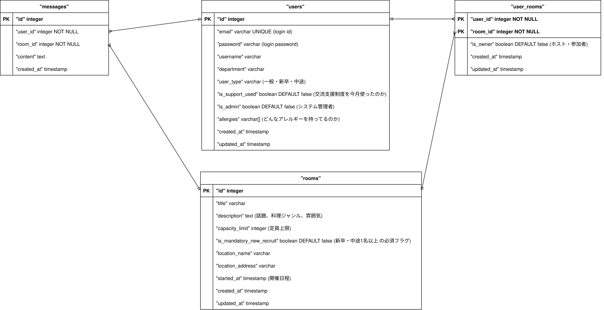

# Exchange-support-system

## About
### 当社の交流支援制度の活用を促進し、社内コミュニケーションを活性化する。

#### ターゲット
社員全員. 特に入社1年未満の社員. 

#### 解決したい課題
- 制度を利用するためのメンバー調整や店舗選定が手間。
- 「誰を誘えばいいか」という心理的な壁。
- 新卒・中途採用者が既存コミュニティに入っていく難しさ。

#### アプローチ
- ルーム作成機能による「目的・属性に応じた」メンバー募集の自動化。
- 店舗情報や参加条件の可視化による、参加への心理的ハードルの低減。

## Key Features
- **ルーム作成 & メンバー募集**: 目的や条件に合わせた募集の自動化
- **店舗情報連携**: 交流場所の選定をスムーズにする機能
- **参加条件の可視化**: 誰でも気軽に参加できる仕組み

## Getting Started
> [!NOTE]
> 現在プロジェクトの初期セットアップ中です。

### Prerequisites
- Docker / Docker Compose
- Node.js (v20+)
- Ruby (v3.3+)

### Setup (Coming Soon)

# 🛠️ Getting Started (開発の始め方)

本プロジェクトでは **Docker** を使用してローカル開発環境を構築します。
付属の `Makefile` を利用することで、コマンド一つで環境の構築・管理が可能です。

---

### 📋 前提条件
- **Docker / Docker Compose** がインストールされていること
- **make** コマンドが利用可能であること

---

### 🚀 クイックスタート

プロジェクトのルートディレクトリで以下のコマンドを実行してください。

イメージのビルドから起動までを一括で行う
``` bash
make
```

|コマンド| 役割| 説明|
|:---:|:---:|:---:|
|make build|ビルド|Dockerイメージを新規作成・更新します。|
|make up|起動|コンテナをバックグラウンド(-d)で起動します。|
|make down|停止|実行中のコンテナを停止します。データは保持されます。|
|make clean|初期化|コンテナとボリューム(DBデータ等)をすべて削除します。|

## Tech Stack
### frontend


### backend


### infra


### ci/cd & tools


## Design Artifacts


